# Ocean Overhaul

Ocean Overhaul is an ocean-content mod for **Minecraft 1.21.1 (Fabric)**. It adds a set of sea-themed decorative + functional blocks, a few ocean items, natural seafloor worldgen deposits (including a bioluminescent deep-ocean **Abyssal Trench**), the **Megalodon** boss shark and its apex **Abyssal Fang** sword, the six-tentacled **Kraken** mini-boss and its **Heart of the Kraken** reward, an underwater combat + traversal kit (the loyalty-returning **Harpoon** and a three-piece **Diving Kit**), a glass **Aquarium** you can keep caught fish in, and a growing cast of passive sea creatures — all wired up against the 1.21.1 Fabric registry API and shipped clean, tested, and **mixin-free**.

## Contents

**Decorative blocks**

- **Abyssal Coral Block** — coral-and-prismarine block
- **Living Abyssal Coral** — spreads underwater, bonemeal-able, dies to Crushed Coral out of water (bonemeal a submerged Abyssal Coral Block to awaken one; it glows faintly and slowly colonizes nearby submerged sand / gravel / dirt / clay / crushed coral into a lacy mat — never smeltable, so the Abyssal Pearl economy is untouched)
- **Sea Glass** — base + stairs + slab
- **Polished Prismarine Bricks** — base + stairs + slab + wall
- **Chiseled Prismarine Tiles** — base + stairs + slab + wall
- **Pearl Block** — base + stairs + slab + wall
- **Pearl Lantern** — full-bright light source (like a sea lantern)
- **Prismarine Crystal Block** — full-bright luminous block
- **Salt Block**, **Barnacle Block**, **Abyssal Pearl Block**, **Crushed Coral Block** — standalone decoratives
- **Glowing Plankton Block**, **Abyssal Vent**, **Giant Clam** — Abyssal Trench bioluminescent deep-ocean blocks (the Giant Clam is now a living block-entity: it grows an Abyssal Pearl over ~a Minecraft day while waterlogged, gapes open + brightens when ready — right-click to harvest and it keeps producing; breaking an empty clam drops nothing, silk touch relocates the clam itself)
- **Aquarium** — a glass tank block-entity: right-click it with a Reef Fish / Jellyfish / Seahorse bucket to store the creature, and watch it swim inside through the glass (right-click empty-handed to bucket it back out)

**Driftwood functional set**

- **Driftwood Planks** — base + stairs + slab + wall
- **Driftwood Fence** + **Fence Gate**
- **Driftwood Door** + **Trapdoor**
- **Driftwood Button** + **Pressure Plate**

**Shipwreck decor set** (crafted-only — no worldgen placement)

- **Anchor** — a chunky flat-plane wrought-iron anchor (shank, stock, arms, ring); faces you when placed and sits anywhere — anvil-style, no support requirement. Pickaxe-mined, waterloggable
- **Ship's Wheel** — a thin spoked driftwood disc mounted on any full solid face (a wall, or a 1×1 driftwood-plank post). Ladder-style attachment: remove the wall and the wheel pops off as an item. Axe-mined, waterloggable
- **Rope** — a climbable 4-px hanging line (pure `minecraft:climbable` tag data, vine-family feel: no collision box, walk into the line and hold jump to climb). Hangs from any center-solid bottom face — full blocks, fence posts, chains — or from another rope, so placing rope under rope extends the line; break the top rope and the whole line cascades down, dropping every rope (a popped waterlogged rope leaves a water source behind). Waterloggable, burnable
- **Tattered Sail** — a 2-px weathered-canvas wall panel with a ragged hem and wind-torn holes; no collision (it's cloth — walk through it). Waterloggable, very burnable

**Items**

- Tide Pearl, Coral Shard, Sea Salt
- Abyssal Pearl, Crushed Coral (crafting ingredients)
- Sea Urchin, Salted Cod (foods)
- **Megalodon Tooth** — guaranteed Megalodon boss drop and the apex-weapon ingredient
- **Abyssal Fang** — apex sword, one tier above Tidal (crafted from Megalodon Teeth + pearls; repaired with teeth)
- **Heart of the Kraken** — the Kraken's guaranteed boss drop: while held in either hand underwater it grants **Conduit Power** (water breathing, underwater vision, and underwater Haste). Not craftable — the boss is the only source.
- **Tidal gear** — Abyssal Pearl tools and armor; wearing all four Tidal armor pieces grants constant **Water Breathing** (the four-piece set bonus, noted on each piece's tooltip)
- **Harpoon** — a throwable projectile that yanks the hit mob toward you (tether) and loyalty-returns to your hand (never lost)
- **Diving Kit** — Flippers (Dolphin's Grace in water), Oxygen Tank (water breathing), and Deep Sea Helmet (night vision when submerged): three armor pieces with worn effects
- **Reef Fish Bucket**, **Jellyfish Bucket**, **Seahorse Bucket** — mob buckets that scoop a creature (the jellyfish and seahorse buckets preserve the color variant, and the seahorse bucket's tooltip names the color it carries)
- **Raw Crab Meat → Cooked Crab Meat → Crab Cake** — the Shore Crab food chain: raw meat is risky (30% chance of Hunger, the raw-chicken treatment), the cook-triple (furnace / smoker / campfire) turns it into solid mid-game food, and the **Crab Cake** (Cooked Crab Meat + Sea Salt + Egg) is the game's best stackable food — golden-carrot saturation at steak nutrition — adding a second renewable consumer to the beach salt-flat economy
- **Crab Carapace** — 25% Shore Crab drop (Looting-scaled) and a pure-data **armor-trim material**: one carapace trims any trimmable armor crab-orange at the smithing table

**Mobs**

- **Megalodon** — a giant boss shark (~200 HP, heavy bite, boss bar, split body hitbox). Spawns rarely in deep oceans, day or night; a spawn egg is in the Ocean Overhaul + Spawn Eggs tabs.
- **Kraken** — a stationary six-tentacled mini-boss anchored to the trench floor: six independently-killable 24-HP tentacles guard an invulnerable 80-HP mantle (purple boss bar, flips red when the last tentacle falls and the mantle is exposed). It grabs swimmers toward itself and lashes anyone in the ring; broken tentacles never regrow, so a fled fight resumes where it left off. Spawns very rarely on the deep-ocean floor; drops glow ink sacs, an Abyssal Pearl (50%), and the guaranteed **Heart of the Kraken**. Spawn egg available.
- **Abyssal Lurker** — a hostile deep-sea anglerfish (elder-guardian sized) with a bioluminescent lure that glows in the dark. Spawns in deep oceans, day or night. Spawn egg available.
- **Reef Fish** — a small, brightly-striped tropical fish that swims in schools. Spawns naturally in oceans; drops Raw Reef Fish (auto-cooked when killed on fire). Spawn egg available.
- **Jellyfish** — a fragile, gently-drifting passive sea creature in five glow-in-the-dark color variants. Rarer ocean spawns in small groups; drops 0–1 slime balls. Spawn egg available.
- **Shore Crab** — the mod's first walking and first **breedable** mob: a small amphibious crab that scuttles the beach sand band, common on every beach from world-gen (it spawns on dry sand *and* the submerged shore floor, day or night). It walks the seabed without floating or drowning and always wanders back ashore on its own; feed two crabs **kelp** (its first husbandry use) for a baby and a renewable protein farm. Drops 1–2 Raw Crab Meat plus a 25% Crab Carapace (Looting scales both; killed-by-fire auto-cooks the meat, babies drop nothing). Spawn egg available.
- **Seahorse** — the **bucketable collect-the-variants coral pet**: a tiny, slow-drifting solitary fish in five colors (yellow, orange, red, teal, purple). It spawns near the surface of warm oceans (rarer in lukewarm) and loiters over living coral — vanilla reefs and the mod's abyssal corals alike, via the data-driven `#oceanoverhaul:seahorse_corals` block tag. Scoop it with a water bucket and its color rides along in the **Seahorse Bucket** (named on the tooltip); release it anywhere and it keeps the color and **never despawns**, or display it in the **Aquarium** (the variant survives that round-trip too). No breeding — the Shore Crab owns that lane; it drops nothing but a rare pinch of bone meal. Spawn egg available.

**Worldgen**

Eleven natural deposits generate on and under the seafloor across ocean / deep-ocean / beach biomes (abyssal coral, crushed coral, barnacle clusters, beach salt flats, deep-ocean abyssal coral patches, abyssal pearl veins, prismarine crystal geodes, a rare pearl geode, and three deep-ocean "Abyssal Trench" deposits — glowing plankton patches, abyssal vent clusters, and giant clam clusters). Reef Fish and Jellyfish spawn naturally in oceans, Seahorses drift in the warm + lukewarm ocean surface band, Shore Crabs scuttle in groups on every beach (and the shallow shore floor just past the tide line), while the Megalodon, the Kraken, and the Abyssal Lurker spawn rarely in deep oceans (day or night) — boss spawns are concentrated in the deep-ocean trench biomes.

**Plankton blooms**

**Deep-ocean** water comes alive with drifting **bioluminescent plankton blooms** — patchy clouds of soft cyan glow-motes, tens of blocks across, that slowly drift through the water (~2 blocks per minute) and sit in the same places for every player on a server. Blooms show at **night** (the whole water column, surface included), or by day only below the sunlit zone — where water depth has attenuated sky light to 0, roughly 14+ blocks under an open surface. Anything swimming fast enough through bloom-charged water — you, a darting fish, a boat, a thrown Harpoon — stirs a brighter **glowing disturbance trail** that fades over about a second, and a charging Megalodon lights up its entire body. Pure client-side ambience: nothing to grind, no drops, no server cost; `/particle oceanoverhaul:plankton_glow ~ ~ ~` works as a free debug affordance.

**Crafting & recipes**

Everything is craftable. The base blocks are made from ocean ingredients (prismarine, coral, pearls, kelp, sea salt); coral recipes accept **any** of the five vanilla coral colors. The driftwood functional blocks (fence, gate, door, trapdoor, button, pressure plate) use vanilla wood-set recipe shapes and counts. Stairs, slabs, and walls have standard crafting recipes, and the stone-like sets (Sea Glass, Polished Prismarine Bricks, Chiseled Prismarine Tiles, Pearl Block) can also be cut on a **stonecutter**. Tide Pearls, Abyssal Pearls, and Crushed Coral pack/unpack to and from their storage blocks, and Sea Salt is smelted from ocean sources.

**Tags**

Blocks are wired into the relevant vanilla tags so they behave like their counterparts: `planks`, `slabs`, `stairs`, `walls`, `wooden_fences`, `wooden_buttons`, `wooden_pressure_plates`, `wooden_doors`, `wooden_trapdoors`, `fence_gates`, `mineable/axe`, `mineable/pickaxe`, `climbable` (the Rope's whole climbing mechanic is this one tag), and `beacon_base_blocks`.

**Creative tab**

- Ocean Overhaul (collects everything above; content is also surfaced in the relevant vanilla tabs for discoverability)

## Install

1. Install [Fabric Loader](https://fabricmc.net/use/) for Minecraft **1.21.1**.
2. Install [Fabric API](https://modrinth.com/mod/fabric-api) for 1.21.1.
3. Download the latest mod jar from the [Releases](https://github.com/VoX/ocean-overhaul/releases) page.
4. Drop the jar into your `mods/` folder and launch the game.

## Build

Requires **JDK 21**.

```bash
./gradlew build
```

The built mod jar lands in `build/libs/` (the file without the `-sources` suffix). Tagged `v*` pushes build automatically and attach that jar to a GitHub Release — see [Releases](https://github.com/VoX/ocean-overhaul/releases) for downloads.

## Roadmap

The mod grows in rounds, each one clean, tested, and reliably-buildable. Already shipped: the decorative + driftwood block sets, ocean items, eleven seafloor worldgen deposits (including the bioluminescent Abyssal Trench), the Megalodon boss with its Megalodon Tooth / Abyssal Fang apex gear, the six-tentacled Kraken mini-boss with its Heart of the Kraken, the passive sea creatures (Reef Fish, Jellyfish, the bucketable five-color Seahorse, and the breedable beach-walking Shore Crab with its Crab Cake food chain + carapace armor trim) and the hostile Abyssal Lurker, the loyalty-returning Harpoon, the three-piece Diving Kit, the Aquarium, the spreading **Living Abyssal Coral** (block ecology: the trench coral is now renewable), and the crafted-only **Shipwreck Decor set** (Anchor, Ship's Wheel, climbable Rope, Tattered Sail — the driftwood lane's dockside extension). Natural next steps:

- More sea creatures (predator/prey behaviours, more variety)
- Ocean **biomes** (warm/cold/deep variants, reefs)
- Larger **worldgen** structures (coral reefs, shipwreck-adjacent decoration)

Contributions and ideas welcome — fork it and build the ocean out.

<!-- RECIPES:START (generated by scripts/gen-recipe-docs.py — do not edit by hand) -->
## Recipes

All 90 recipes the mod adds, generated straight from the recipe JSON (`scripts/gen-recipe-docs.py`). Shaped patterns are shown row-by-row (`.` = empty slot) with a key legend; “Any Coral” / “Any Coral Block” means any of the five vanilla coral colors works.

### Crafting table (58)

| Result | Qty | Kind | Ingredients |
| --- | --- | --- | --- |
| Abyssal Coral Block | 4 | Shaped | `PCP / CPC / PCP`  (P = Prismarine, C = Any Coral Block) |
| Abyssal Fang | 1 | Shaped | `T / A / S`  (T = Megalodon Tooth, A = Abyssal Pearl, S = Stick) |
| Abyssal Pearl | 9 | Shapeless | Abyssal Pearl Block |
| Abyssal Pearl Block | 1 | Shaped | `### / ### / ###`  (# = Abyssal Pearl) |
| Aquarium | 1 | Shaped | `GGG / GBG / GGG`  (G = Sea Glass, B = Water Bucket) |
| Barnacle Block | 1 | Shapeless | 2× Crushed Coral + 2× Sea Salt |
| Chiseled Prismarine Tiles | 4 | Shaped | `## / ##`  (# = Polished Prismarine Bricks) |
| Chiseled Prismarine Tiles Slab | 6 | Shaped | `###`  (# = Chiseled Prismarine Tiles) |
| Chiseled Prismarine Tiles Stairs | 4 | Shaped | `#.. / ##. / ###`  (# = Chiseled Prismarine Tiles) |
| Chiseled Prismarine Tiles Wall | 6 | Shaped | `### / ###`  (# = Chiseled Prismarine Tiles) |
| Coral Shard | 1 | Shapeless | Any Coral |
| Crab Cake | 1 | Shapeless | Cooked Crab Meat + Sea Salt + Egg |
| Crushed Coral | 2 | Shapeless | Coral Shard |
| Crushed Coral | 9 | Shapeless | Crushed Coral Block |
| Crushed Coral Block | 1 | Shaped | `### / ### / ###`  (# = Crushed Coral) |
| Deep Sea Helmet | 1 | Shaped | `AAA / AGA`  (A = Abyssal Pearl, G = Glass Pane) |
| Driftwood Button | 1 | Shapeless | Driftwood Plank |
| Driftwood Door | 3 | Shaped | `## / ## / ##`  (# = Driftwood Plank) |
| Driftwood Fence Gate | 1 | Shaped | `#W# / #W#`  (# = Stick, W = Driftwood Plank) |
| Driftwood Plank | 8 | Shaped | `PPP / PSP / PPP`  (P = Any Planks, S = Sea Salt) |
| Driftwood Plank Fence | 3 | Shaped | `W#W / W#W`  (W = Driftwood Plank, # = Stick) |
| Driftwood Plank Slab | 6 | Shaped | `###`  (# = Driftwood Plank) |
| Driftwood Plank Stairs | 4 | Shaped | `#.. / ##. / ###`  (# = Driftwood Plank) |
| Driftwood Plank Wall | 6 | Shaped | `### / ###`  (# = Driftwood Plank) |
| Driftwood Pressure Plate | 1 | Shaped | `##`  (# = Driftwood Plank) |
| Driftwood Trapdoor | 2 | Shaped | `### / ###`  (# = Driftwood Plank) |
| Flippers | 1 | Shaped | `A.A / A.A`  (A = Coral Shard) |
| Harpoon | 1 | Shaped | `..A / .I. / S..`  (A = Abyssal Pearl, I = Iron Ingot, S = Stick) |
| Kelp Roll | 1 | Shapeless | Kelp + Cod + Dried Kelp |
| Oxygen Tank | 1 | Shaped | `A.A / AGA / AAA`  (A = Tide Pearl, G = Glass) |
| Pearl Block | 1 | Shaped | `### / ### / ###`  (# = Tide Pearl) |
| Pearl Block Slab | 6 | Shaped | `###`  (# = Pearl Block) |
| Pearl Block Stairs | 4 | Shaped | `#.. / ##. / ###`  (# = Pearl Block) |
| Pearl Block Wall | 6 | Shaped | `### / ###`  (# = Pearl Block) |
| Pearl Lantern | 1 | Shaped | `SPS / PPP / SPS`  (P = Tide Pearl, S = Sea Salt) |
| Polished Prismarine Bricks | 4 | Shaped | `## / ##`  (# = Prismarine Bricks) |
| Polished Prismarine Bricks Slab | 6 | Shaped | `###`  (# = Polished Prismarine Bricks) |
| Polished Prismarine Bricks Stairs | 4 | Shaped | `#.. / ##. / ###`  (# = Polished Prismarine Bricks) |
| Polished Prismarine Bricks Wall | 6 | Shaped | `### / ###`  (# = Polished Prismarine Bricks) |
| Prismarine Crystal Block | 1 | Shaped | `### / ### / ###`  (# = Prismarine Crystals) |
| Salt Block | 1 | Shaped | `### / ### / ###`  (# = Sea Salt) |
| Salted Cod | 1 | Shapeless | Cooked Cod + Sea Salt |
| Sea Glass | 1 | Shapeless | Glass + Prismarine Shard |
| Sea Glass Slab | 6 | Shaped | `###`  (# = Sea Glass) |
| Sea Glass Stairs | 4 | Shaped | `#.. / ##. / ###`  (# = Sea Glass) |
| Sea Salt | 9 | Shapeless | Salt Block |
| Sea Urchin | 1 | Shapeless | Crushed Coral + Coral Shard |
| Seafood Stew | 1 | Shapeless | Bowl + Cooked Reef Fish + Sea Urchin + Kelp |
| Tidal Axe | 1 | Shaped | `AA / AS / .S`  (A = Abyssal Pearl, S = Stick) |
| Tidal Boots | 1 | Shaped | `A.A / A.A`  (A = Abyssal Pearl) |
| Tidal Chestplate | 1 | Shaped | `A.A / AAA / AAA`  (A = Abyssal Pearl) |
| Tidal Helmet | 1 | Shaped | `AAA / A.A`  (A = Abyssal Pearl) |
| Tidal Hoe | 1 | Shaped | `AA / .S / .S`  (A = Abyssal Pearl, S = Stick) |
| Tidal Leggings | 1 | Shaped | `AAA / A.A / A.A`  (A = Abyssal Pearl) |
| Tidal Pickaxe | 1 | Shaped | `AAA / .S. / .S.`  (A = Abyssal Pearl, S = Stick) |
| Tidal Shovel | 1 | Shaped | `A / S / S`  (A = Abyssal Pearl, S = Stick) |
| Tidal Sword | 1 | Shaped | `A / A / S`  (A = Abyssal Pearl, S = Stick) |
| Tide Pearl | 9 | Shapeless | Pearl Block |

### Smelting & cooking (9)

| Result | Process | Source | XP | Time (ticks) |
| --- | --- | --- | --- | --- |
| Abyssal Pearl | Smelt | Abyssal Coral Block | 0.3 | 200 |
| Cooked Crab Meat | Campfire | Raw Crab Meat | 0.35 | 600 |
| Cooked Crab Meat | Smelt | Raw Crab Meat | 0.35 | 200 |
| Cooked Crab Meat | Smoke | Raw Crab Meat | 0.35 | 100 |
| Cooked Reef Fish | Campfire | Raw Reef Fish | 0.35 | 600 |
| Cooked Reef Fish | Smelt | Raw Reef Fish | 0.35 | 200 |
| Cooked Reef Fish | Smoke | Raw Reef Fish | 0.35 | 100 |
| Sea Salt | Smelt | Kelp | 0.1 | 200 |
| Tide Pearl | Smelt | Prismarine Crystals | 0.3 | 200 |

### Stonecutter (23)

| Result | Qty | Cut from |
| --- | --- | --- |
| Chiseled Prismarine Tiles | 1 | Polished Prismarine Bricks |
| Chiseled Prismarine Tiles | 1 | Prismarine Bricks |
| Chiseled Prismarine Tiles Slab | 2 | Polished Prismarine Bricks |
| Chiseled Prismarine Tiles Slab | 2 | Prismarine Bricks |
| Chiseled Prismarine Tiles Slab | 2 | Chiseled Prismarine Tiles |
| Chiseled Prismarine Tiles Stairs | 1 | Polished Prismarine Bricks |
| Chiseled Prismarine Tiles Stairs | 1 | Prismarine Bricks |
| Chiseled Prismarine Tiles Stairs | 1 | Chiseled Prismarine Tiles |
| Chiseled Prismarine Tiles Wall | 1 | Polished Prismarine Bricks |
| Chiseled Prismarine Tiles Wall | 1 | Prismarine Bricks |
| Chiseled Prismarine Tiles Wall | 1 | Chiseled Prismarine Tiles |
| Pearl Block Slab | 2 | Pearl Block |
| Pearl Block Stairs | 1 | Pearl Block |
| Pearl Block Wall | 1 | Pearl Block |
| Polished Prismarine Bricks | 1 | Prismarine Bricks |
| Polished Prismarine Bricks Slab | 2 | Prismarine Bricks |
| Polished Prismarine Bricks Slab | 2 | Polished Prismarine Bricks |
| Polished Prismarine Bricks Stairs | 1 | Prismarine Bricks |
| Polished Prismarine Bricks Stairs | 1 | Polished Prismarine Bricks |
| Polished Prismarine Bricks Wall | 1 | Prismarine Bricks |
| Polished Prismarine Bricks Wall | 1 | Polished Prismarine Bricks |
| Sea Glass Slab | 2 | Sea Glass |
| Sea Glass Stairs | 1 | Sea Glass |

<!-- RECIPES:END -->

<!-- RECIPE-IMAGES:START (generated by scripts/gen-recipe-images.py) -->
## Crafting recipes (visual)

Every crafting-table recipe the mod adds, rendered as the grid + result (icons are real in-game GUI renders). See **Recipes** above for smelting & stonecutter.

<table>
<tr>
<td align="center">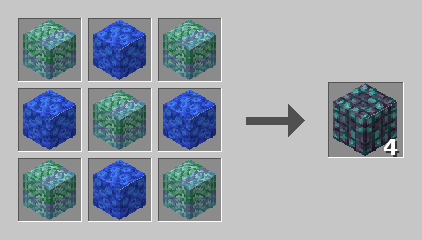<br><sub>Abyssal Coral Block ×4</sub></td>
<td align="center">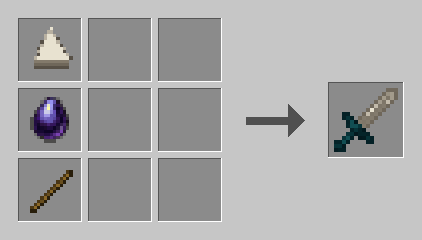<br><sub>Abyssal Fang</sub></td>
</tr>
<tr>
<td align="center">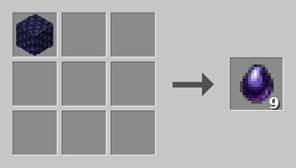<br><sub>Abyssal Pearl ×9</sub></td>
<td align="center">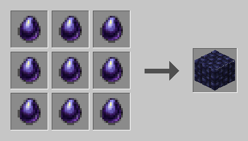<br><sub>Abyssal Pearl Block</sub></td>
</tr>
<tr>
<td align="center">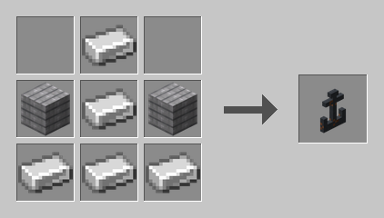<br><sub>Anchor</sub></td>
<td align="center">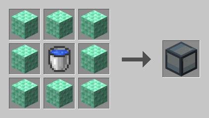<br><sub>Aquarium</sub></td>
</tr>
<tr>
<td align="center">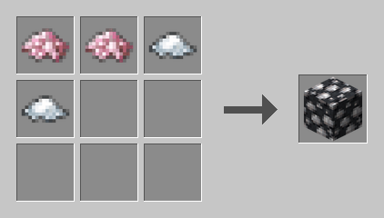<br><sub>Barnacle Block</sub></td>
<td align="center">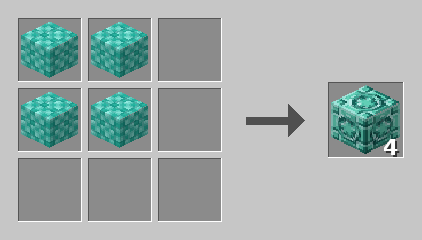<br><sub>Chiseled Prismarine Tiles ×4</sub></td>
</tr>
<tr>
<td align="center">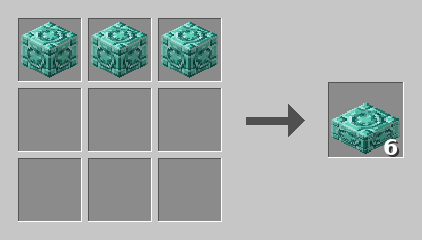<br><sub>Chiseled Prismarine Tiles Slab ×6</sub></td>
<td align="center">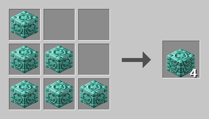<br><sub>Chiseled Prismarine Tiles Stairs ×4</sub></td>
</tr>
<tr>
<td align="center">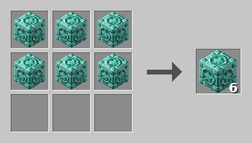<br><sub>Chiseled Prismarine Tiles Wall ×6</sub></td>
<td align="center">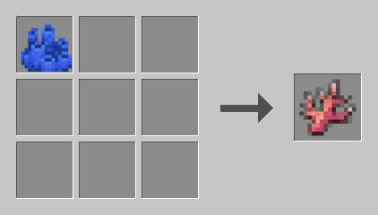<br><sub>Coral Shard</sub></td>
</tr>
<tr>
<td align="center">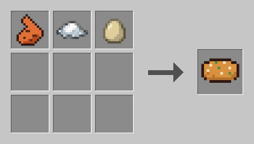<br><sub>Crab Cake</sub></td>
<td align="center">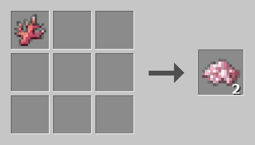<br><sub>Crushed Coral ×2</sub></td>
</tr>
<tr>
<td align="center">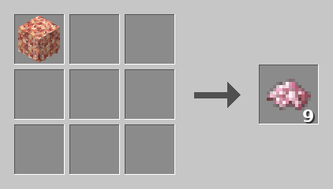<br><sub>Crushed Coral ×9</sub></td>
<td align="center">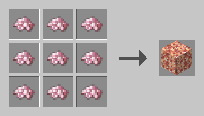<br><sub>Crushed Coral Block</sub></td>
</tr>
<tr>
<td align="center">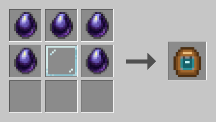<br><sub>Deep Sea Helmet</sub></td>
<td align="center">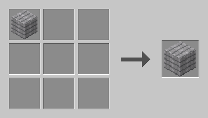<br><sub>Driftwood Button</sub></td>
</tr>
<tr>
<td align="center">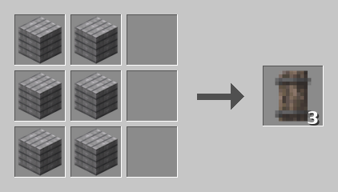<br><sub>Driftwood Door ×3</sub></td>
<td align="center">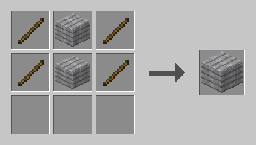<br><sub>Driftwood Fence Gate</sub></td>
</tr>
<tr>
<td align="center">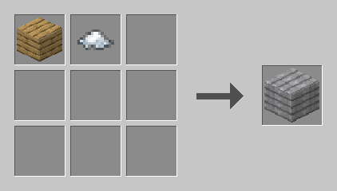<br><sub>Driftwood Plank ×8</sub></td>
<td align="center">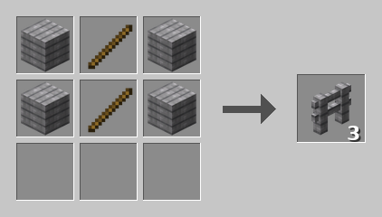<br><sub>Driftwood Plank Fence ×3</sub></td>
</tr>
<tr>
<td align="center">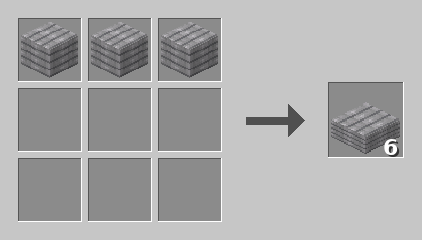<br><sub>Driftwood Plank Slab ×6</sub></td>
<td align="center">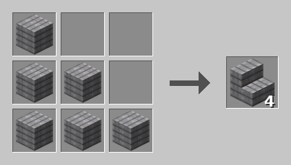<br><sub>Driftwood Plank Stairs ×4</sub></td>
</tr>
<tr>
<td align="center">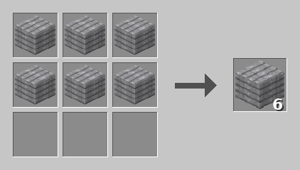<br><sub>Driftwood Plank Wall ×6</sub></td>
<td align="center">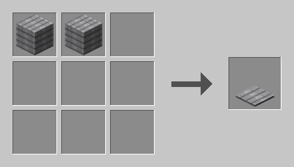<br><sub>Driftwood Pressure Plate</sub></td>
</tr>
<tr>
<td align="center">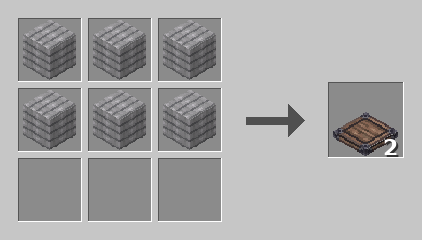<br><sub>Driftwood Trapdoor ×2</sub></td>
<td align="center">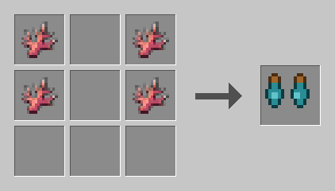<br><sub>Flippers</sub></td>
</tr>
<tr>
<td align="center">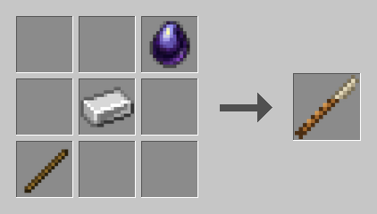<br><sub>Harpoon</sub></td>
<td align="center">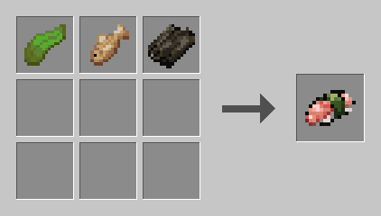<br><sub>Kelp Roll</sub></td>
</tr>
<tr>
<td align="center">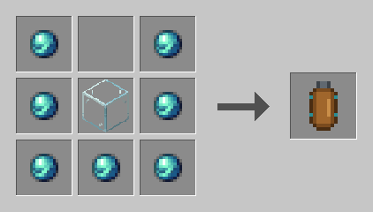<br><sub>Oxygen Tank</sub></td>
<td align="center">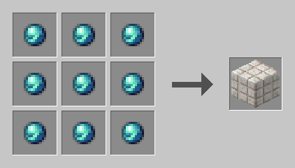<br><sub>Pearl Block</sub></td>
</tr>
<tr>
<td align="center">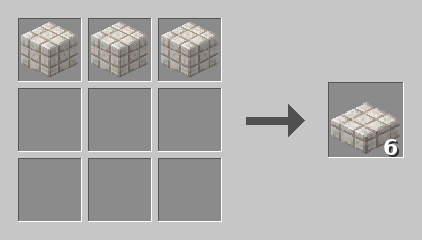<br><sub>Pearl Block Slab ×6</sub></td>
<td align="center">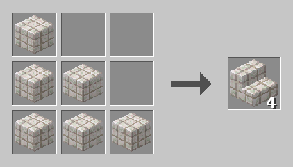<br><sub>Pearl Block Stairs ×4</sub></td>
</tr>
<tr>
<td align="center">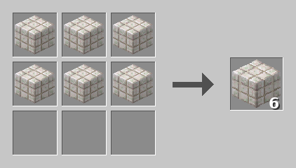<br><sub>Pearl Block Wall ×6</sub></td>
<td align="center">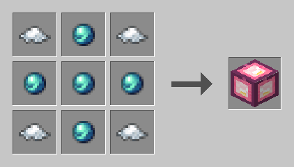<br><sub>Pearl Lantern</sub></td>
</tr>
<tr>
<td align="center">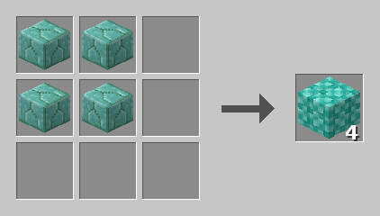<br><sub>Polished Prismarine Bricks ×4</sub></td>
<td align="center">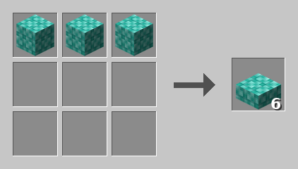<br><sub>Polished Prismarine Bricks Slab ×6</sub></td>
</tr>
<tr>
<td align="center">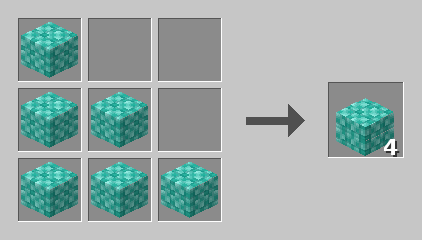<br><sub>Polished Prismarine Bricks Stairs ×4</sub></td>
<td align="center">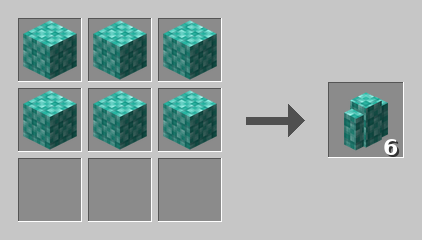<br><sub>Polished Prismarine Bricks Wall ×6</sub></td>
</tr>
<tr>
<td align="center">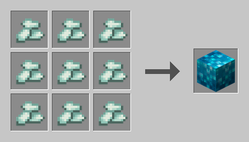<br><sub>Prismarine Crystal Block</sub></td>
<td align="center">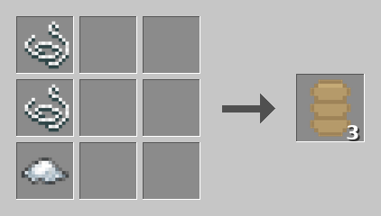<br><sub>Rope ×3</sub></td>
</tr>
<tr>
<td align="center">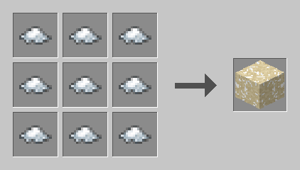<br><sub>Salt Block</sub></td>
<td align="center">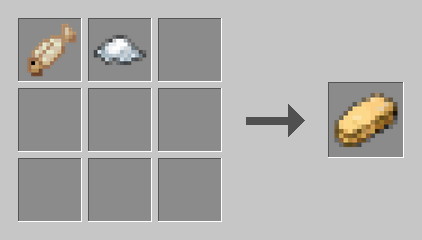<br><sub>Salted Cod</sub></td>
</tr>
<tr>
<td align="center">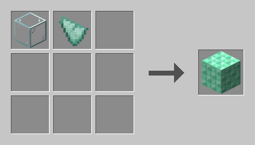<br><sub>Sea Glass</sub></td>
<td align="center">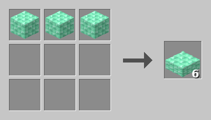<br><sub>Sea Glass Slab ×6</sub></td>
</tr>
<tr>
<td align="center">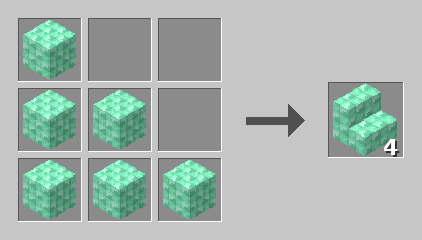<br><sub>Sea Glass Stairs ×4</sub></td>
<td align="center">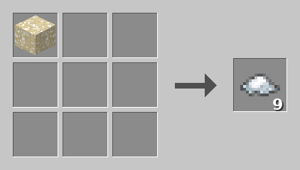<br><sub>Sea Salt ×9</sub></td>
</tr>
<tr>
<td align="center">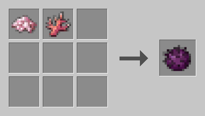<br><sub>Sea Urchin</sub></td>
<td align="center">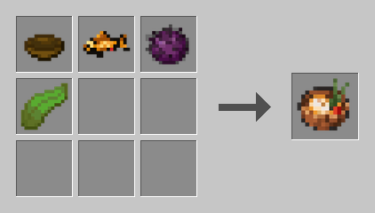<br><sub>Seafood Stew</sub></td>
</tr>
<tr>
<td align="center"><br><sub>Ships Wheel</sub></td>
<td align="center"><br><sub>Tattered Sail ×2</sub></td>
</tr>
<tr>
<td align="center"><br><sub>Tidal Axe</sub></td>
<td align="center"><br><sub>Tidal Boots</sub></td>
</tr>
<tr>
<td align="center"><br><sub>Tidal Chestplate</sub></td>
<td align="center"><br><sub>Tidal Helmet</sub></td>
</tr>
<tr>
<td align="center"><br><sub>Tidal Hoe</sub></td>
<td align="center"><br><sub>Tidal Leggings</sub></td>
</tr>
<tr>
<td align="center"><br><sub>Tidal Pickaxe</sub></td>
<td align="center"><br><sub>Tidal Shovel</sub></td>
</tr>
<tr>
<td align="center"><br><sub>Tidal Sword</sub></td>
<td align="center"><br><sub>Tide Pearl ×9</sub></td>
</tr>
</table>
<!-- RECIPE-IMAGES:END -->

## License

Released under the [MIT License](LICENSE).
